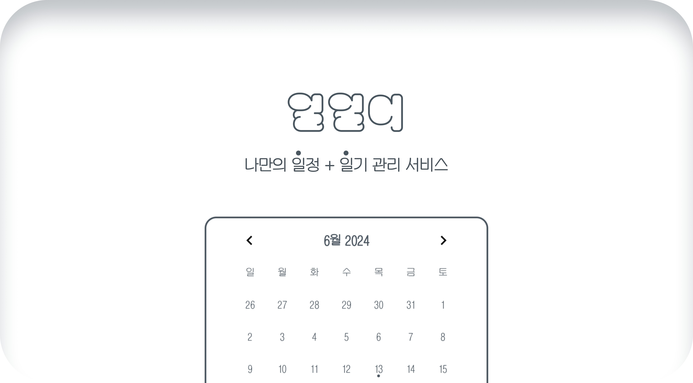
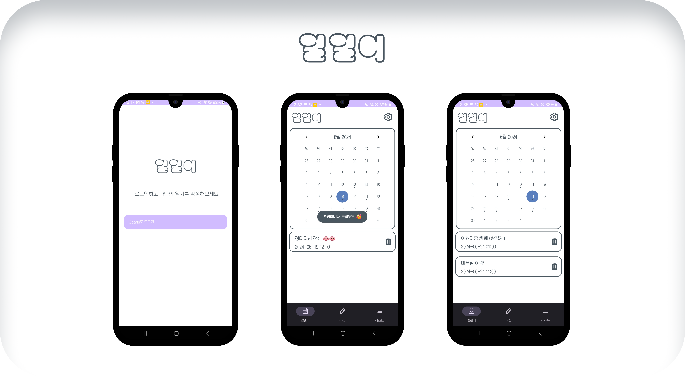
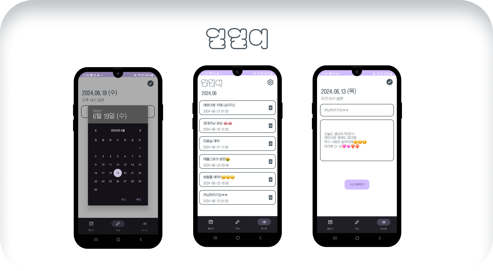

# <center> ⚪️ 일일이 - 나만의 일정 + 일기 관리 서비스 </center>
### Download
- 아래 링크 접속 후 이메일 기입 -> 이메일 확인
  
- [일일이 Android App 다운로드하기](https://appdistribution.firebase.dev/i/c7c0899216e52eee)

## ⚪️ 주요 기능
### 1. 로그인 / 캘린더뷰


- Google 로그인
- 커스텀 캘린더 Material CalenderView 사용
- 커스텀 토스터 Styleable Toast 사용
- 리사이클러뷰로 날짜 별 일정 목록 출력
  
### 2. 일정 작성 / 리스트뷰


- 일정 데이터 firebase 저장
- 리사이클러뷰로 일정 목록 출력 및 조회
  
## ⚪️ 개발 환경
### 사용 스택

| Application |  Language | Framework | Back, DB |
| ---- | ---- | ---- | ---- | 
| Android App | Kotlin | Android Studio | Firebase |

### 프로젝트 구조
```bash
oneone2
├── CalendarDecorators.kt   
├── Calender.kt          // 프래그먼트1
├── Lists.kt             // 프래그먼트2
├── LoginActivity.kt
├── MainActivity.kt
├── Write.kt             // 프래그먼트3
├── adapter              // 일기 리스트 리사이클러뷰를 위한 어답터
│   └── DiaryAdapter.kt
├── config                  
│   └── ApplicationClass.kt
├── model                // 유저, 일기 객체 생성
│   ├── Diary.kt
│   ├── User.kt          
│   ├── UserDao.kt
│   └── UserDatabase.kt  // 유저는 local DB 사용하므로 설정
├── repository        
│   └── UserRepository.kt // 유저는 local DB 사용하므로 설정
└── viewmodel            // 뷰 모델
    ├── DiaryViewModel.kt  
    └── UserViewModel.kt

```

### Database
- firebase realtime database 구조
- user
    - diaries
        - contentId
        - title
        - content (null)
        - photo(null)
        - timestamp (yyyy/mm/dd hh:mm)

### **Plugins**
    - Login : Firebase Authentication
    - Server Databse : Firebase Realtime Database
    - Local Database : room db
    - CI/CD : Firebase App Distribution
    - Calender : Material Calender View
    - Toast : Styleable Toast


## ⚪️ 프로젝트 산출물
- [일일이 Notion 워크스페이스 가기](https://woozy-passbook-d4b.notion.site/3d0a32e4d2904317a37bdc4508057f96?pvs=4)

* 단기 개인 프로젝트인 관계로 git은 마스터브랜치를 사용
